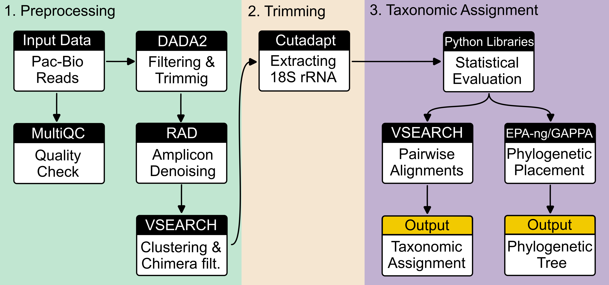

# Vampyrellid diversity exploration 2023

## Table of Contents
1. [Project Description](#project-description)
2. [Initial Data](#initial-data)
3. [Project Workflow Overview](#project-workflow-overview)
4. [Step-by-Step Process Flow](#step-by-step-process-flow)
5. [Reference Alignments and Trees](#reference-alignments-and-trees)
6. [Project Folder Hierarchy](#project-folder-hierarchy)
7. [How to Replicate the Project Analyzes](#how-to-replicate-the-project-analyzes)

## Project Description

This project aims to explore Vampyrellid's diversity using long-read metabarcoding.

## Initial data

In total, we collected nine environmental samples and one mock sample. All environmental DNA has been extraced using the Qiagen's PowerSoil Powerlyser Kit, and sent to sequencing facility at Dalhousie University (Halifax, Canada). The IMR sequenced the full 18S rRNA amplicon fragments using the Sequel II instrument (Pacific Biosciences) on an SMRT Cell 8M Tray.
The details on librabry preparation, and sequencing are described on the IMR website: https://imr.bio/protocols.html.

We received demultiplexed raw reads in fastq format with phred+33 encoding from IMR. \
Files: /raw_data/PacBio/<project_name>/{cell1, cell2}


## Project workflow overview



## Step-by-Step Process Flow: Scripts and Data I/O
The table below provides a detailed look at each step in our bioinformatics analysis pipeline, including the scripts used and the corresponding input and output data.

|Step                  | Script                                             | Input                                          | Output                                         |
|----------------------|----------------------------------------------------|------------------------------------------------|------------------------------------------------|
|Initial steps         | [`tax_assign_01_merge_cells.sh`][script1]          | raw_data/pacbio_reads -> cell 1, 2             | raw_data/pacbio_reads -> cell_combined         |
|Quality check         | [`tax_assign_02_inspect_reads_quality.sh`][script2]| raw_data/pacbio_reads -> cell_combined         | results -> [multiqc][multiqc]                  |
|Trimming              | [`tax_assign_03_dada2_trimming.r`][script3]        | raw_data/pacbio_reads -> cell_combined         | raw_data/dada2 -> noprimers                    |
|Filtering             | [`tax_assign_04_dada2_filtering.r`][script4]       | raw_data/dada2 -> noprimers                    | raw_data/dada2 -> filtered                     |
|Denoising             | [`tax_assign_05a_dada2_denoising.sh`][script5]     | raw_data/dada2 -> filtered                     | results/denoised -> dada2                      |
|Denoising (optional)  | [`tax_assign_05b_RAD.sh`][script6]                 | raw_data/dada2 -> filtered                     | results/denoised -> RAD                        |
|Extract 18S (optional)| [`tax_assign_05c_extract_18S.sh`][script7]         | results/denoised -> dada2/RAD                  | results/denoised -> extracted_18S              |
|Clustering            | [`tax_assign_06_cluster_otu.sh`][script8]          | results/denoised -> dada2/RAD                  | results/clustered -> sim_xy                    |
|Chimera filtering     | [`tax_assign_07_chimera_filt.sh`][script9]         | results/clustered -> sim_xy                    | results -> chimera_filtered                    |
|Tax. assign. (VSEARCH)| [`tax_assign_08_taxassign.sh`][script10]           | results -> chimera_filtered                    | results -> [tax_assignment_vsearch][ta_vsearch]|
|Creating summary table| [`tax_assign_09_create_summary_table.py`][script11]| results -> [tax_assignment_vsearch][ta_vsearch]| results -> final_tables                        |


[script1]: https://github.com/wRajter/pacbio_long_reads/blob/master/scripts/tax_assign_01_merge_cells.sh
[script2]: https://github.com/wRajter/pacbio_long_reads/blob/master/scripts/tax_assign_02_inspect_reads_quality.sh
[script3]: https://github.com/wRajter/pacbio_long_reads/blob/master/scripts/tax_assign_03_dada2_trimming.r
[script4]: https://github.com/wRajter/pacbio_long_reads/blob/master/scripts/tax_assign_04_dada2_filtering.r
[script5]: https://github.com/wRajter/pacbio_long_reads/blob/master/scripts/tax_assign_05a_dada2_denoising.sh
[script6]: https://github.com/wRajter/pacbio_long_reads/blob/master/scripts/tax_assign_05b_RAD.sh
[script7]: https://github.com/wRajter/pacbio_long_reads/blob/master/scripts/tax_assign_05c_extract_18S.sh
[script8]: https://github.com/wRajter/pacbio_long_reads/blob/master/scripts/tax_assign_06_cluster_otu.sh
[script9]: https://github.com/wRajter/pacbio_long_reads/blob/master/scripts/tax_assign_07_chimera_filt.sh
[script10]: https://github.com/wRajter/pacbio_long_reads/blob/master/scripts/bash/tax_assign_08_taxassign.sh
[script11]: https://github.com/wRajter/pacbio_long_reads/blob/master/scripts/tax_assign_09_create_summary_table.sh
[multiqc]: https://github.com/wRajter/pacbio_long_reads/blob/master/results/multiqc
[ta_vsearch]: https://github.com/wRajter/pacbio_long_reads/blob/master/results/tax_assignment_vsearch

## Reference alignments and trees

For the **taxonomic assignment**, we used the full [PR2 SSU UTAX database (version 5.0.0)](https://github.com/pr2database/pr2database/releases/tag/v5.0.0). We updated the PR2 database with 128 vampyrellid sequences using Python code, see the [modify_pr2_database](https://github.com/wRajter/vampyrella_2023/blob/master/notebooks/modify_pr2_database.ipynb) Jupyter notebook, for a more accurate and refined taxonomic assignment of vampyrellids.

## Project Folder Hierarchy

Below is the structure of the project directory explaining the purpose of each folder:


- **results/**: Contains output from various stages of analysis.
- **notebooks/**: Jupyter notebooks with executable code blocks for analyses.
- **raw_data/**: Raw datasets and intermediate files (not on GitHub due to size constraints; available upon request).
- **scripts/**: This folder contains all the scripts:
  - **julia/**: Scripts written in Julia programming language.


## How to Replicate the Project Analyzes

To replicate the analyses performed in this project, follow the steps below:

### Prerequisites

- [Git](https://git-scm.com/)
- [Python](https://www.python.org/) v3.11
- [Julia](https://julialang.org/) v1.9.2
- [vsearch](https://github.com/torognes/vsearch) v2.22.1
- [FastQC](https://www.bioinformatics.babraham.ac.uk/projects/fastqc/) v0.11.9
- [MultiQC](https://multiqc.info/) v1.17

### Environment Setup

1. Clone the project repository:
   ```bash
   git clone https://github.com/wRajter/vampyrella_2023.git
   cd vampyrella_2023
2. (Optional) Create a virtual environment:
    ```bash
    python3.11 -m venv vampyrella_2023
3. Install the required Python packages:
    ```bash
    pip install -r requirements.txt


## Install R packages:
To install necessary R packages, run the `install_packages.R` script located in the `scripts` directory.<br>
Running the script can be done by executing the following in the R console:
```R
source("install_packages.R")
```
The script should check if a package is installed and install it if it's not.
